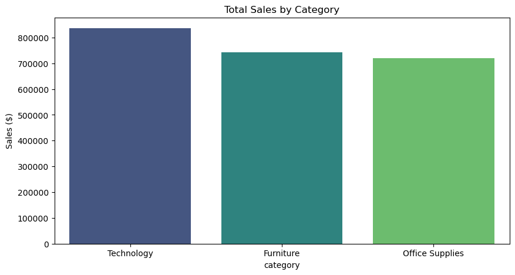
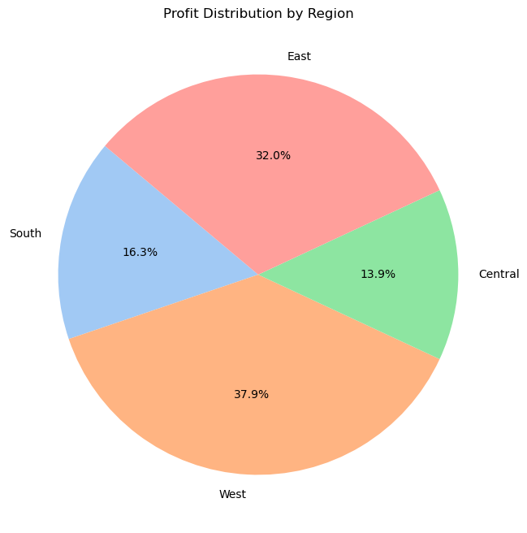

<div align="center">
  <a href="SQL_SCENARIOS.md">
    
  </a>
  <p><em>Click the banner to view the full analysis report</em></p>
</div>

# 📊 End-to-End Retail Sales Analytics


## 📌 Project Overview
This project demonstrates a full-cycle data analysis workflow—from raw data extraction to actionable business insights. Using a real-world **Superstore Retail Dataset**, I engineered a pipeline to load data into a **MySQL** database, performed complex SQL analysis, and visualized the results using **Python (Matplotlib/Seaborn)**.

The goal was to answer critical business questions regarding sales trends, profit margins, and regional performance.

---

## 🛠️ Tech Stack
* **Language:** Python 3.x
* **Database:** MySQL
* **Libraries:** Pandas, SQLAlchemy, PyMySQL, Matplotlib, Seaborn
* **Tools:** VS Code, Jupyter Notebook

---

## 📂 Project Structure
```bash
Retail-Sales-SQL-Project/
│
├── data/
│   └── superstore_sales.csv     # Raw dataset
├── scripts/
│   ├── data_loader.py           # ETL Script: CSV -> MySQL
│   ├── analysis.sql             # 20+ Analytical Queries
│   └── dashboard.py             # Python Visualization Script
├── images/
│   └── (Screenshots of charts)  # Generated visual insights
├── README.md                    # Project Documentation
├── requirements.txt             # Dependencies
└── SQL_SCENARIOS.md             # Detailed breakdown of SQL queries
```

📈 Dashboard Insights
Here are the key visualizations generated by the dashboard.py script.

## 1. Monthly Sales Trend
Visualizing revenue growth over time to identify seasonality.


## 2. Sales by Category
Comparing performance across major product categories.



## 3. Profit Distribution by Region
Understanding which regions are most profitable.



---

🚀 How to Run
1. Clone the repository from [GitHub](https://github.com/sanaurrehmanarain/Retail-Sales-Analytics-SQL.git):
```bash
git clone https://github.com/sanaurrehmanarain/Retail-Sales-Analytics-SQL.git
```
2. Install dependencies:

```Bash
pip install -r requirements.txt
```
3. Setup Database:

    -Create a MySQL database named `sales_db`.

    -Update database credentials in `data_loader.py`.

4. Run the ETL Script:

```Bash
python data_loader.py
```
5. Visualize Data:

```Bash
python dashboard.py
```

📧 Contact

For any questions or feedback, feel free to reach out via LinkedIn.
