# 🧠 SQL Analysis Scenarios
This document records the 20 analytical queries executed on the `sales_db` database.

---

### 1. Quick Data Check
**Goal:** Verify data loading and column structure.
```sql
SELECT * FROM retail_sales LIMIT 10;
```

**Output:**

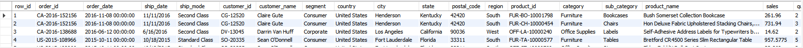

---

### 2. Total Orders
**Goal:** Check the volume of the dataset.
```sql
SELECT COUNT(*) AS total_orders FROM retail_sales;
```

**Output:**

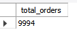

---

### 3. Total Revenue & Profit
**Goal:** Calculate high-level financial metrics.
```sql
SELECT 
    ROUND(SUM(sales), 2) AS total_revenue,
    ROUND(SUM(profit), 2) AS total_profit
FROM retail_sales;
```

**Output:**

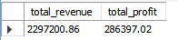

---

### 4. Distinct Categories
**Goal:** Understand the product hierarchy.
```sql
SELECT DISTINCT category FROM retail_sales;
```

**Output:**

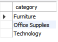

---

### 5. Top 5 Best-Selling Products
**Goal:** Identify key revenue drivers.
```sql
SELECT product_name, ROUND(SUM(sales), 2) AS total_sales
FROM retail_sales
GROUP BY product_name
ORDER BY total_sales DESC
LIMIT 5;
```

**Output:**

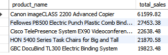

---

### 6. Regional Sales Performance
**Goal:** Compare sales volume across regions.
```sql
SELECT region, COUNT(*) AS num_orders, ROUND(SUM(sales), 2) AS total_sales
FROM retail_sales
GROUP BY region
ORDER BY total_sales DESC;
```

**Output:**

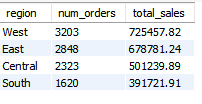

---

### 7. Average Order Value (AOV)
**Goal:** Determine the average spend per transaction.
```sql
SELECT ROUND(AVG(sales), 2) AS avg_order_value FROM retail_sales;
```

**Output:**

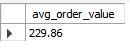

---

### 8. Loss-Making Orders
**Goal:** Identify transactions with negative profit.
```sql
SELECT order_id, product_name, profit 
FROM retail_sales 
WHERE profit < 0
ORDER BY profit ASC 
LIMIT 10;
```

**Output:**

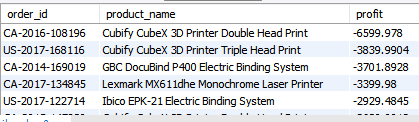

---

### 9. Annual Sales Summary
**Goal:** View sales performance by year.
```sql
SELECT YEAR(order_date) AS sales_year, ROUND(SUM(sales), 2) AS total_sales
FROM retail_sales
GROUP BY sales_year
ORDER BY sales_year;
```

**Output:**

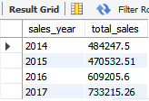

---

### 10. Monthly Sales Trend
**Goal:** Detailed timeline of sales performance.
```sql
SELECT 
    DATE_FORMAT(order_date, '%Y-%m') AS month_year, 
    ROUND(SUM(sales), 2) AS monthly_sales
FROM retail_sales
GROUP BY month_year
ORDER BY month_year;
```

**Output:**

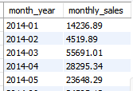

---

### 11. Most Profitable Categories
**Goal:** Find which categories yield the highest margin.
```sql
SELECT category, ROUND(SUM(profit), 2) AS total_profit
FROM retail_sales
GROUP BY category
ORDER BY total_profit DESC
LIMIT 3;
```

**Output:**

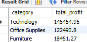

---

### 12. Shipping Mode Analysis
**Goal:** See which shipping methods are most popular.
```sql
SELECT ship_mode, ROUND(SUM(sales), 2) AS total_sales
FROM retail_sales
GROUP BY ship_mode;
```

**Output:**

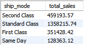

---

### 13. Top Spending Customer (LTV)
**Goal:** Identify the highest-value customer.
```sql
SELECT customer_id, customer_name, ROUND(SUM(sales), 2) AS total_spent
FROM retail_sales
GROUP BY customer_id, customer_name
ORDER BY total_spent DESC
LIMIT 1;
```

**Output:**

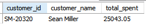

---

### 14. Order Volume by Day
**Goal:** Check which days of the week are busiest.
```sql
SELECT DAYNAME(order_date) AS day_of_week, COUNT(*) AS num_orders
FROM retail_sales
GROUP BY day_of_week
ORDER BY num_orders DESC;
```

**Output:**

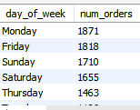

---

### 15. High Sales, Low Profit Sub-Categories
**Goal:** Spot inefficiencies where sales are high but profit is low.
```sql
SELECT sub_category, ROUND(SUM(sales), 2) AS total_sales, ROUND(SUM(profit), 2) AS total_profit
FROM retail_sales
GROUP BY sub_category
ORDER BY total_sales DESC
LIMIT 10;
```

**Output:**

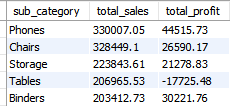

---

### 16. Specific Regional Search
**Goal:** Filter for high-value sales in the East.
```sql
SELECT product_name, sales, region
FROM retail_sales
WHERE region = 'East' AND sales > 500;
```

**Output:**

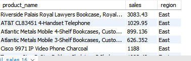

---

### 17. Profit Margin Calculation
**Goal:** Calculate percentage profit margin per category.
```sql
SELECT 
    category, 
    ROUND((SUM(profit) / SUM(sales)) * 100, 2) AS profit_margin_percentage
FROM retail_sales
GROUP BY category
ORDER BY profit_margin_percentage DESC;
```

**Output:**

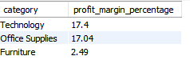

---

### 18. Running Total (Window Function)
**Goal:** Calculate cumulative sales over time.
```sql
SELECT 
    order_date, 
    sales, 
    SUM(sales) OVER (ORDER BY order_date) AS running_total
FROM retail_sales
LIMIT 20;
```

**Output:**

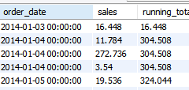

---

### 19. Regional Product Ranking (Window Function)
**Goal:** Rank sub-categories by sales within their specific region.
```sql
SELECT 
    region, 
    sub_category, 
    ROUND(SUM(sales), 2) AS region_sales,
    RANK() OVER (PARTITION BY region ORDER BY SUM(sales) DESC) AS rank_in_region
FROM retail_sales
GROUP BY region, sub_category;
```

**Output:**

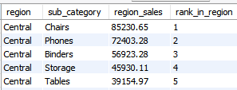

---

### 20. Year-Over-Year Growth
**Goal:** Compare current year sales to previous year sales.
```sql
WITH yearly_sales AS (
    SELECT YEAR(order_date) AS year, SUM(sales) AS total_sales
    FROM retail_sales
    GROUP BY year
)
SELECT 
    year, 
    total_sales, 
    LAG(total_sales) OVER (ORDER BY year) AS prev_year_sales,
    ROUND((total_sales - LAG(total_sales) OVER (ORDER BY year)) / 
          LAG(total_sales) OVER (ORDER BY year) * 100, 2) AS growth_percentage
FROM yearly_sales;
```

**Output:**

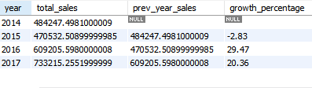